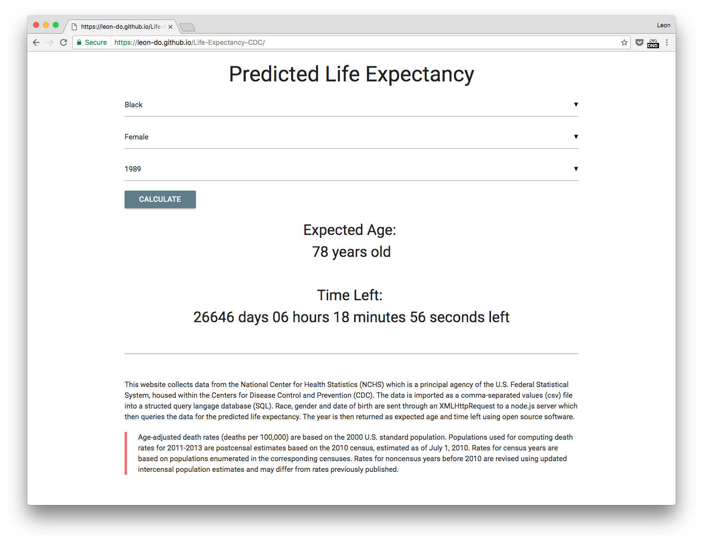

<h2> Predicting human life expectancy using data from CDC. </h2>

<h3> Description: </h3>

This website (https://leon-do.github.io/Life-Expectancy-CDC/) collects data from the National Center for Health Statistics (NCHS) which is a principal agency of the U.S. Federal Statistical System, housed within the Centers for Disease Control and Prevention (CDC). The data is imported as a comma-separated values (csv) file into a structed query langage database (SQL). Race, gender and date of birth are sent through an API call to a node.js server which then queries the data for the predicted life expectancy. The year is then returned as a countdown (time left) using open source software.

<h3> Source: </h3>

https://blogs.cdc.gov/nchs-data-visualization/deaths-in-the-us/

<h4> NCHS - Age-adjusted death rates and life-expectancy at birth, (All Races, Both Sexes): United States, 1900-2013 </h4>

Age-adjusted death rates (deaths per 100,000) are based on the 2000 U.S. standard population. Populations used for computing death rates for 2011-2013 are postcensal estimates based on the 2010 census, estimated as of July 1, 2010. Rates for census years are based on populations enumerated in the corresponding censuses. Rates for noncensus years before 2010 are revised using updated intercensal population estimates and may differ from rates previously published.
